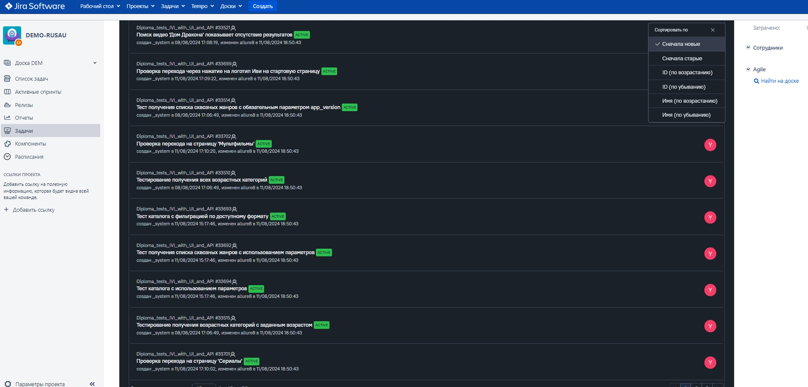
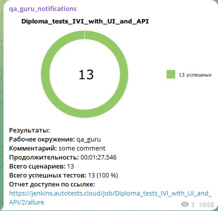
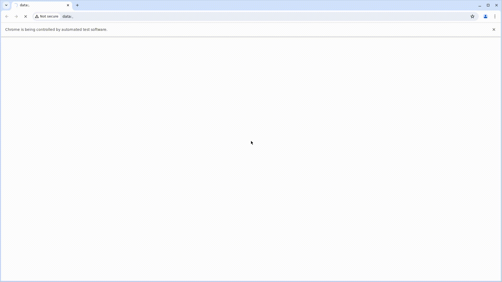

# Дипломный проект по автоматизации тестирования сайта "Онлайн кинотеатр IvI"

> <a target="_blank" href="https://www.ivi.ru/">ivi.ru</a>

----

### Особенности проекта

* Оповещения о тестовых прогонах в Telegram
* Отчеты с видео, скриншотом, логами, исходной моделью разметки страницы
* Сборка проекта в Jenkins
* Отчеты Allure Report
* Интеграция с Allure TestOps
* Автоматизация отчетности о тестовых прогонах и тест-кейсах в Jira
* Запуск web/UI автотестов
* Запуск API автотестов

### Список проверок, реализованных в web/UI автотестах

- [x] Главная страница сайта отображается
- [x] Проверка логотипа сайта, ведет на главную страницу
- [x] Проверка строки поиска, поиск дает отрицательные результаты
- [x] Проверка строки поиска, поиск предлагает альтернативные варианты
- [x] Проверка кнопки "Уведомления" отображается, открывает окно уведомлений
- [x] Проверка кнопки "Фильмы", открывает окно фильмы
- [x] Проверка кнопки "Сериалы", открывает окно сериалы
- [x] Проверка кнопки "Мультфильмы", открывает окно мультфильмы

### Список проверок, реализованных в API автотестах

- [x] Проверка списка возрастных категорий
- [x] Проверка списка сквозных жанров
- [x] Проверка каталога сборников и единичного контента

----

### Используемый стэк

----

### Проект в Jenkins

> <a target="_blank" href="https://jenkins.autotests.cloud/job/Diploma_tests_IVI_with_UI_and_API/">Ссылка</a>

#### Проект в Jenkins

* Открыть <a target="_blank" href="https://jenkins.autotests.cloud/job/Diploma_tests_IVI_with_UI_and_API/">проект</a>

----

### Allure отчет

#### <a target="_blank" href="https://jenkins.autotests.cloud/job/Diploma_tests_IVI_with_UI_and_API/19/allure/">Общие результаты</a>

#### <a target="_blank" href="https://jenkins.autotests.cloud/job/Diploma_tests_IVI_with_UI_and_API/21/allure/#suites/#suites">Результаты прохождения теста</a>

----

### Интеграция с Allure TestOps

> <a target="_blank" href="https://allure.autotests.cloud/project/4362/dashboards">Ссылка на проект</a>

#### <a target="_blank" href="https://allure.autotests.cloud/project/4362/dashboards">Дашборд с общими показателями тестовых прогонов</a>

#### <a target="_blank" href="https://allure.autotests.cloud/project/4362/test-cases/33526?treeId=0">Тест кейсы</a>

#### <a target="_blank" href="https://allure.autotests.cloud/launch/40883/tree/657633/attachments?treeId=0">Результаты тестов</a>

#### <a target="_blank" href="https://allure.autotests.cloud/project/3910/test-cases/28510?treeId=0">Ручной тест-кейс</a>

----

### Интеграция с Jira

----

### Оповещения в Telegram

----

### Видео прохождения web/UI автотеста

